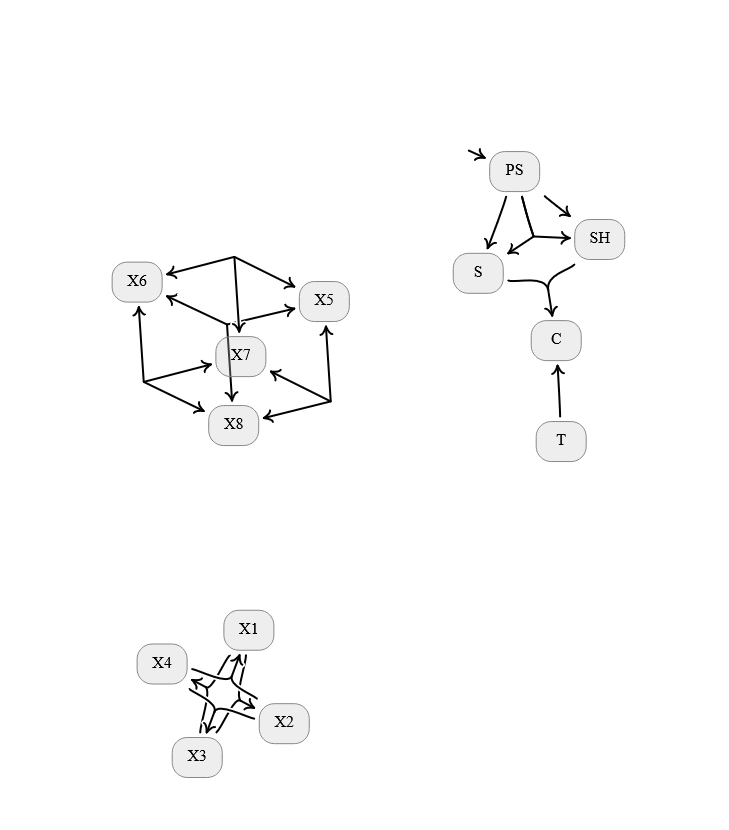

# Directed Hypergraph Visualization

Everyone loves graphs (i.e., networks). 
Directed ones are the ones with arrows. 
The term *hypergraph* has come to represent an undire	

*Directed hypergraphs*, on the other hand, are a surprisingly intuitive and---weargue---underappreciated way of visualizing many things. 
Here is a blatently biased sample of some of them. 
The graphical representation advocated for here is the basis of:
 - Probabilistic Dependency Graphs (PDGs), a class of graphical models that generalizes the standard ones (Bayesian Networks, Causal Graphs, Factor Graphs and their linear exponential families), as well as 
 - Generalized Causal Models
 - Hyperflow Networks, that generalize Generative Flow Networks to allow for particles that can "split" and "merge". 

On the one hand, directed hypergraphs can be viewed as a significant generalization of directed graphsthat allow a single arrow to point to and from multiple things at once.  Yet, perhaps unintuitively, they also correspond exactly to bipartite directed graphs. That equivalent view of directed hypergraphs has a more familiar but arguably clunkier graphical representation, and is present in the standard presentations of such as:
 
 - Petri Nets, an extremely popular way of modeling concurrent processes chemical systems
 - Directed Factor graphs, a form of probabilistic graphical model that combines some benefits of qualitative directed graphical models with the expressive power of

(( This code is a fork of the visualization method from the PDG repository. ))

